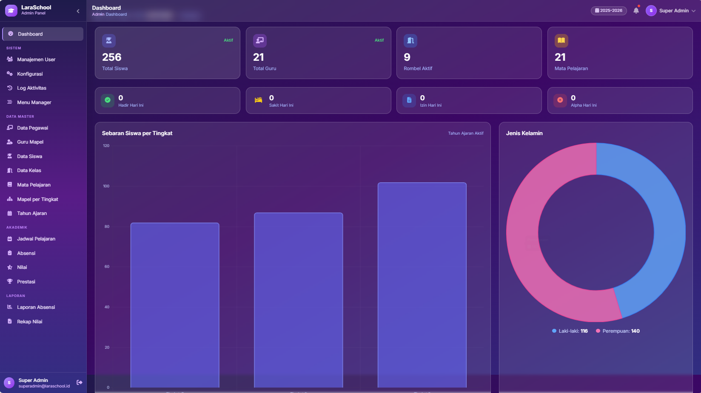
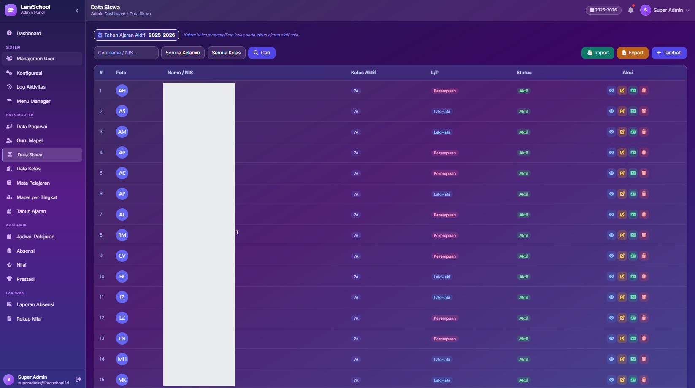
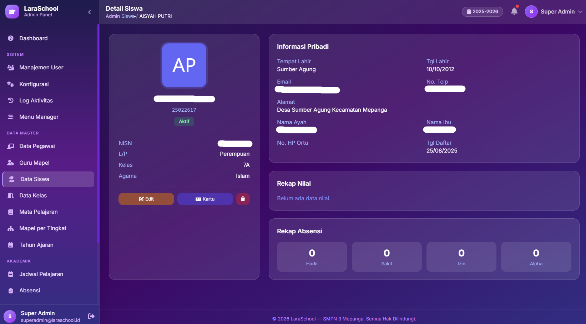
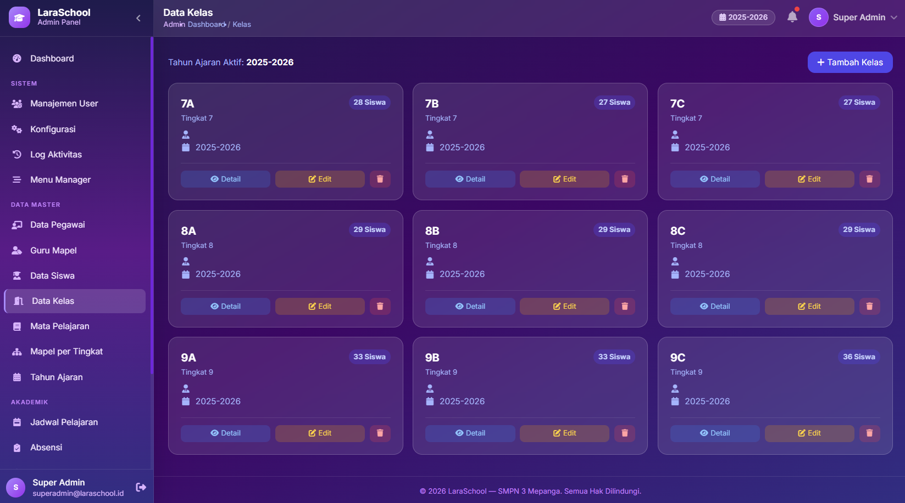
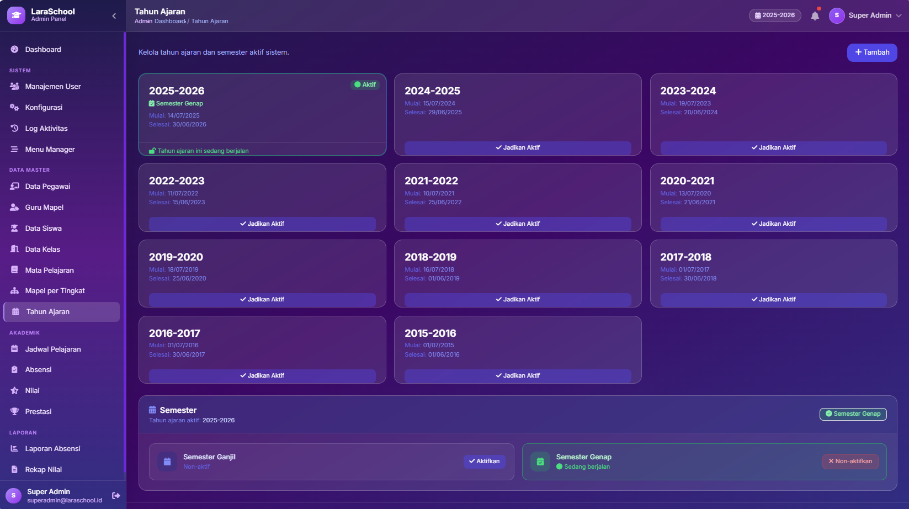
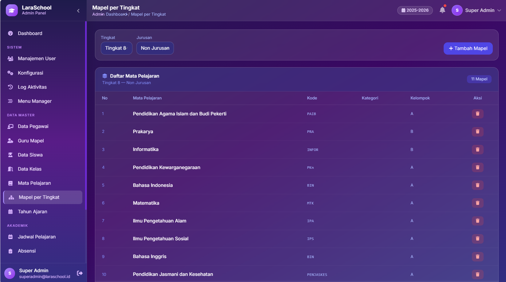
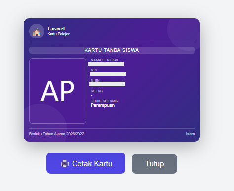
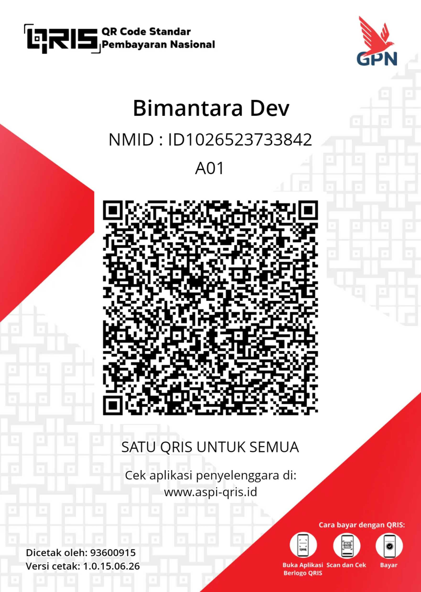

# 🏫 LaraSchool — Sistem Informasi Manajemen Sekolah

<p align="center">
  
</p>

**LaraSchool** adalah aplikasi web manajemen sekolah berbasis **Laravel 13** yang dirancang untuk memudahkan pengelolaan data akademik, kepegawaian, dan kesiswaan secara terpadu dalam satu platform. Dibangun dengan antarmuka modern bergaya *glassmorphism* menggunakan Tailwind CSS, LaraSchool hadir dengan tiga panel akses terpisah: **Admin**, **Guru**, dan **Siswa**.

---

## ✨ Fitur Utama

### 🛠️ Panel Admin

| Modul | Keterangan |
|---|---|
| **Dashboard** | Statistik ringkas: jumlah siswa, guru, kelas, dan aktivitas terkini |
| **Data Siswa** | CRUD lengkap, kartu siswa, detail profil, import/export Excel |
| **Data Pegawai** | Manajemen guru & staf, foto, jabatan, status kepegawaian |
| **Kelas / Rombel** | Pengelolaan rombongan belajar per tahun ajaran |
| **Mata Pelajaran** | CRUD mapel, pemetaan per tingkat, penugasan ke guru |
| **Jadwal Pelajaran** | Jadwal mengajar per kelas & hari |
| **Nilai** | Input nilai batch per kelas & mata pelajaran |
| **Absensi** | Rekap kehadiran siswa + laporan |
| **Prestasi Siswa** | Pencatatan prestasi akademik & non-akademik |
| **Tahun Ajaran** | Manajemen siklus tahun ajaran & semester, toggle aktif |
| **Ekstrakurikuler** | Data kegiatan ekstrakurikuler sekolah |
| **Manajemen User** | CRUD akun pengguna, toggle status aktif |
| **Konfigurasi Sekolah** | Profil & pengaturan umum sekolah |
| **Log Aktivitas** | Audit trail seluruh aktivitas sistem (powered by Spatie Activity Log) |
| **Menu Manager** | Konfigurasi menu sidebar dinamis (khusus Super Admin) |

### 👨‍🏫 Panel Guru

| Modul | Keterangan |
|---|---|
| **Dashboard** | Ringkasan jadwal mengajar hari ini & kelas yang diampu |
| **Jadwal Mengajar** | Tampilan jadwal mengajar per hari |
| **Input Nilai** | Entry nilai harian, mid, dan semester per siswa |
| **Absensi Siswa** | Input kehadiran siswa per sesi |
| **Rapor** | Preview & cetak rapor siswa |
| **Monitoring Siswa** | Pantau perkembangan nilai & kehadiran siswa per kelas |

### 🎓 Panel Siswa

| Modul | Keterangan |
|---|---|
| **Dashboard** | Ringkasan data diri, kelas, dan info sekolah |
| **Nilai** | Lihat nilai per mata pelajaran & detail perkembangan |
| **Profil** | Update data pribadi & foto profil |

---

## 📸 Screenshots

<table>
  <tr>
    <td align="center"><br><sub>Data Siswa</sub></td>
    <td align="center"><br><sub>Detail Siswa</sub></td>
  </tr>
  <tr>
    <td align="center"><br><sub>Data Kelas</sub></td>
    <td align="center"><br><sub>Tahun Ajaran</sub></td>
  </tr>
  <tr>
    <td align="center"><br><sub>Mapel per Tingkat</sub></td>
    <td align="center"><br><sub>Cetak Kartu Siswa</sub></td>
  </tr>
</table>

---

## 🚀 Manfaat bagi Sekolah

- **Efisiensi administrasi** — Data siswa, guru, nilai, dan absensi tersimpan terpusat dan mudah diakses kapan saja
- **Transparansi** — Siswa dapat memantau nilai dan kehadirannya secara mandiri melalui portal siswa
- **Akurasi data** — Tidak ada duplikasi data siswa meski berpindah kelas antar tahun ajaran
- **Audit trail** — Setiap perubahan data tercatat otomatis dalam log aktivitas
- **Multi-peran** — Hak akses terkontrol: Super Admin, Admin Sekolah, Operator, Kepala Sekolah, Guru, Wali Kelas, Guru BK, dan Siswa
- **Tampilan modern** — Antarmuka *glassmorphism* yang responsif dan nyaman digunakan di desktop maupun mobile

---

## 🛠️ Tech Stack

| Komponen | Versi |
|---|---|
| PHP | 8.3+ |
| Laravel | 13.x |
| Database | MariaDB / MySQL |
| CSS Framework | Tailwind CSS 3 (via Vite) |
| UI Libraries | Alpine.js, DataTables, SweetAlert2, Toastr, Dropzone |
| Auth & RBAC | Spatie Laravel Permission |
| Activity Log | Spatie Laravel Activitylog |

---

## ⚙️ Cara Instalasi

### Prasyarat
- PHP 8.3+
- Composer
- Node.js & NPM
- MariaDB / MySQL

### Langkah Instalasi

```bash
# 1. Clone repository
git clone https://github.com/yourusername/laraschool.git
cd laraschool

# 2. Install dependensi PHP
composer install

# 3. Install dependensi Node.js
npm install

# 4. Salin file konfigurasi
cp .env.example .env

# 5. Generate application key
php artisan key:generate
```

**6. Konfigurasi database di `.env`:**

```env
DB_CONNECTION=mysql
DB_HOST=127.0.0.1
DB_PORT=3306
DB_DATABASE=lara_school
DB_USERNAME=root
DB_PASSWORD=
```

```bash
# 7. Import database (gunakan file SQL yang tersedia)
mysql -u root -p lara_school < database/lara_school.sql

# 8. Build asset CSS/JS
npm run build

# 9. Jalankan server
php artisan serve
```

**10. Akses aplikasi:**

| Panel | URL | Akun Default |
|---|---|---|
| Admin | `http://localhost:8000/admin/login` | Sesuai data seed |
| Guru | `http://localhost:8000/guru/login` | Sesuai data seed |
| Siswa | `http://localhost:8000/siswa/login` | NIS sebagai username & password |

---

## ☕ Dukung Pengembangan — Donasi

Proyek ini dikembangkan secara mandiri dan terus diperbarui. Dukungan Anda sangat berarti untuk keberlanjutan pengembangan LaraSchool!

<p align="center">
  
</p>

<p align="center"><strong>Scan QR di atas untuk donasi via DANA</strong></p>

### 🎁 Keuntungan Donasi

| Nominal | Keuntungan |
|---|---|
| Minimal **Rp 250.000** | Akses source code terbaru + support instalasi |
| Lebih besar = lebih prioritas | **Donasi terbesar** mendapatkan prioritas utama untuk **custom coding** sesuai kebutuhan sekolah Anda |

> 💡 **Semakin besar donasi Anda, semakin cepat kebutuhan custom Anda diproses!**

### 📊 Pantau Progress Donasi & Development

Lihat perkembangan project donasi dan fitur yang sedang dikerjakan di:

**👉 [www.nursahid.com/page/projects-donasi](http://www.nursahid.com/page/projects-donasi)**

---

## 📄 Lisensi

LaraSchool dikembangkan untuk keperluan pendidikan. Penggunaan ulang atau distribusi harap menghubungi pengembang terlebih dahulu.

---

<p align="center">Dibuat dengan ❤️ menggunakan Laravel &amp; Tailwind CSS</p>
